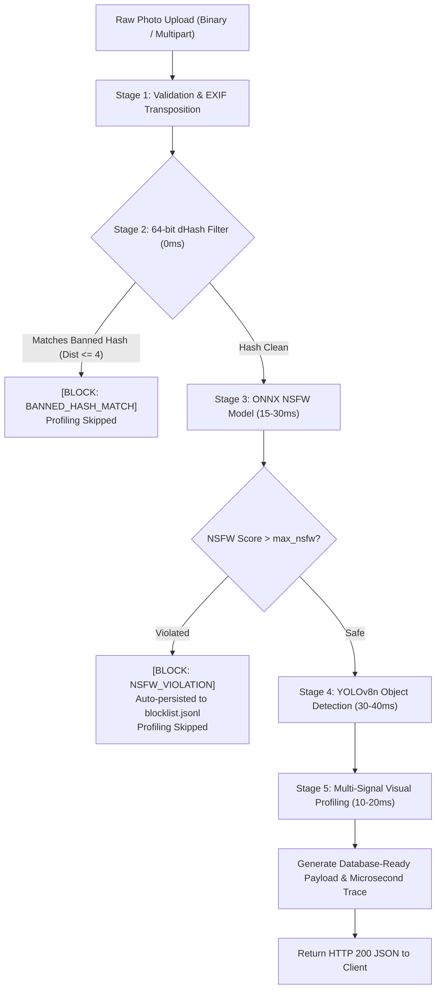

# 🏛️ 02 - System Architecture & Technical Design

This document details the layered software architecture, Clean Architecture separation of concerns, dataflow models, and concurrent threading mechanics of `image-guard`.

---

## 1. System Vision & Purpose

`image-guard` is an independent, **100% offline edge microservice** specifically designed as the backend intelligence engine for **Mobile Memory Note & Photo-Sharing Apps**.

It solves two interdependent challenges in a single, high-throughput CPU pipeline:
1. **Safety Guardrail**: Rejects explicit (NSFW) imagery and banned duplicate images (via 64-bit dHash) *before* they are committed to application databases or cloud storage.
2. **Contextual User Profiling**: Extracts user habits, hobbies (culinary, tech, travel, pets, commercial signs, nature sunsets) and automatically generates engaging note captions and hashtags tailored to the user's language and timezone.

---

## 2. Clean Architecture (5-Layer Model)

The codebase strictly enforces single-responsibility boundaries across five distinct packages:

```
┌────────────────────────────────────────────────────────┐
│                   Presentation Layer                   │
│         api/server.py (ThreadingHTTPServer)            │
│       - HTTP Request/Response Serialization            │
│       - DoS Guardrail (MAX_UPLOAD_SIZE = 20MB)         │
│       - CORS Preflight & Headers                       │
└───────────────────────────┬────────────────────────────┘
                            │
┌───────────────────────────▼────────────────────────────┐
│                    Services Layer                      │
│             services/pipeline.py                       │
│       - Input Validation & EXIF Normalization          │
│       - Orchestration & Fail-Fast Pipeline             │
│       - Circuit Breaker Exception Handling             │
└─────────────┬────────────────────────────┬─────────────┘
              │                            │
┌─────────────▼──────────────┐ ┌───────────▼─────────────┐
│       Guards Layer         │ │     Profiling Layer     │
│   guards/dhash.py (0ms)    │ │ profiling/detector.py   │
│   guards/nsfw.py (15-30ms) │ │ profiling/profiler.py   │
│                            │ │ profiling/visual_analyzer│
└─────────────┬──────────────┘ └───────────┬─────────────┘
              │                            │
┌─────────────▼────────────────────────────▼─────────────┐
│                     Core Layer                         │
│   core/config.py (Thresholds, Paths, Limits)           │
│   core/types.py (DTOs, Dataclasses, Schemas)           │
│   core/i18n.py (Localization VI/EN/JA/KO, Timezone)    │
│   core/process_logger.py (AI Agent Microsecond Traces) │
└────────────────────────────────────────────────────────┘
```

### Detailed Layer Responsibilities:
1. **Presentation Layer (`api/`)**:
   - `server.py`: Subclasses Python's native `http.server.ThreadingHTTPServer`. Provides multi-threaded request processing, CORS handling, query param extraction (`?lang=vi&tz=Asia/Ho_Chi_Minh`), streaming upload parsing, and DoS payload limiting.
2. **Services Layer (`services/`)**:
   - `pipeline.py`: The central orchestrator. Ingests raw binary buffers, transposes EXIF orientation, dispatches moderation tiers under the Fail-Fast protocol, triggers multi-signal profiling, and writes traces to the telemetry logger.
3. **Guards Layer (`guards/`)**:
   - `dhash.py`: 64-bit gradient difference perceptual hashing engine and dual-indexed $O(1)$ `BlocklistManager`.
   - `nsfw.py`: CPU-optimized ONNX classifier for adult content detection using dynamic thresholds from `rules.json`.
4. **Profiling Layer (`profiling/`)**:
   - `detector.py`: YOLOv8n object detection model (Letterbox $640 \times 640$, pure NumPy NMS).
   - `visual_analyzer.py`: Multi-signal analyzer assessing aspect ratio, color warmth gradients, and lazy OCR via `rapidocr-onnxruntime`.
   - `profiler.py`: Knowledge synthesizer mapping objects and scene signals to user lifestyle taxonomy, social settings, captions, and tags.
5. **Core Layer (`core/`)**:
   - `config.py`: Threshold configuration (`rules.json`), model filepaths, upload limits (`20MB`).
   - `types.py`: Standard DTOs (`GuardResult`, `UserProfileInsight`, `ProcessResponse`).
   - `i18n.py`: Quad-language localization engine (`vi`, `en`, `ja`, `ko`) and timezone calculations.
   - `process_logger.py`: High-precision microsecond telemetry and database-ready payload builder.

---

## 3. Dataflow & Pipeline Execution Flow



---

## 4. Concurrency Model & DoS Protection

- **ThreadingHTTPServer**: Each incoming HTTP request from mobile devices is dispatched to a dedicated thread from Python's standard thread pool. Processing large images does not block concurrent uploads from other users.
- **Thread-Safe Blocklist Operations**: `BlocklistManager` utilizes a `threading.Lock` during updates to `blocklist.jsonl`, ensuring ACID consistency across concurrent worker threads.
- **Hard Limit DoS Guardrail**: Maximum payload size is enforced at `MAX_UPLOAD_SIZE = 20 * 1024 * 1024` (20MB). Requests exceeding this limit are aborted immediately during stream ingestion with HTTP `413 Payload Too Large`.

---

## 5. Self-Healing Bootstrap

When the system boots via `run.py` or `bootstrap.py`:
1. Validates the Python runtime version ($\ge 3.10$).
2. Validates mandatory packages (`numpy`, `pillow`, `onnxruntime`).
3. Verifies the presence and integrity of ONNX weight files:
   - `model.onnx` (~23MB, NSFW Classifier)
   - `yolov8n.onnx` (~12MB, YOLOv8 Nano)
4. If weights are missing or corrupt, downloads them atomically (writing to temporary files before renaming) to prevent corrupted files due to network interruptions.
